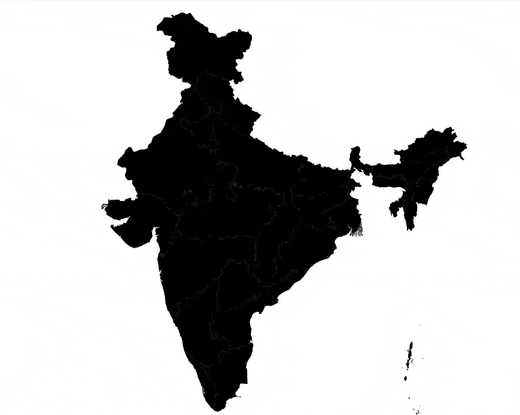

# React India Map Component

An interactive SVG India map component for React applications with TypeScript support. This component allows you to create clickable and hoverable state regions with custom data and styling.



## Installation

```Shell
npm install @vishalvoid/react-india-map
```

## Usage

```tsx
import { IndiaMap } from "@vishalvoid/react-india-map";
import type { StateData } from "@vishalvoid/react-india-map";

const App = () => {
  const mapStyle = {
    backgroundColor: "#ffffff",
    hoverColor: "#dddddd",
    tooltipConfig: {
      backgroundColor: "rgba(0, 0, 0, 0.8)",
      textColor: "#ffffff",
    },
  };

  const stateData: StateData[] = [
    {
      id: "IN-MH",
      customData: {
        population: "123.2M",
        capital: "Mumbai",
      },
    },
  ];

  const handleStateHover = (stateId: string, stateInfo?: StateData) => {
    console.log(`Hovering over ${stateId}`, stateInfo);
  };

  const handleStateClick = (stateId: string, stateInfo?: StateData) => {
    console.log(`Clicked on ${stateId}`, stateInfo);
  };

  return (
    <IndiaMap
      mapStyle={mapStyle}
      stateData={stateData}
      onStateHover={handleStateHover}
      onStateClick={handleStateClick}
    />
  );
};
```

## Props

```typescript
interface TooltipConfig {
  backgroundColor?: string; // Default: "rgba(0, 0, 0, 0.8)"
  textColor?: string; // Default: "#ffffff"
}

interface MapStyle {
  backgroundColor?: string; // Default: "#ffffff"
  hoverColor?: string; // Default: "#dddddd"
  tooltipConfig?: TooltipConfig;
  stroke?: string; // Default: "#000000"
  strokeWidth?: number; // Default: 1
}

interface StateData {
  id: string; // State ID (e.g., "IN-MH")
  customData?: {
    [key: string]: any; // Custom state data
  };
}

interface IndiaMapProps {
  mapStyle?: MapStyle;
  stateData?: StateData[];
  onStateHover?: (stateId: string, stateInfo?: StateData) => void;
  onStateClick?: (stateId: string, stateInfo?: StateData) => void;
}
```

## State IDs Reference

| State/UT          | ID    | Capital            |
| ----------------- | ----- | ------------------ |
| Andhra Pradesh    | IN-AP | Amaravati          |
| Arunachal Pradesh | IN-AR | Itanagar           |
| Assam             | IN-AS | Dispur             |
| Bihar             | IN-BR | Patna              |
| Chhattisgarh      | IN-CT | Raipur             |
| Goa               | IN-GA | Panaji             |
| Gujarat           | IN-GJ | Gandhinagar        |
| Haryana           | IN-HR | Chandigarh         |
| Himachal Pradesh  | IN-HP | Shimla             |
| Jharkhand         | IN-JH | Ranchi             |
| Karnataka         | IN-KA | Bengaluru          |
| Kerala            | IN-KL | Thiruvananthapuram |
| Madhya Pradesh    | IN-MP | Bhopal             |
| Maharashtra       | IN-MH | Mumbai             |
| Manipur           | IN-MN | Imphal             |
| Meghalaya         | IN-ML | Shillong           |
| Mizoram           | IN-MZ | Aizawl             |
| Nagaland          | IN-NL | Kohima             |
| Odisha            | IN-OR | Bhubaneswar        |
| Punjab            | IN-PB | Chandigarh         |
| Rajasthan         | IN-RJ | Jaipur             |
| Sikkim            | IN-SK | Gangtok            |
| Tamil Nadu        | IN-TN | Chennai            |
| Telangana         | IN-TG | Hyderabad          |
| Tripura           | IN-TR | Agartala           |
| Uttar Pradesh     | IN-UP | Lucknow            |
| Uttarakhand       | IN-UT | Dehradun           |
| West Bengal       | IN-WB | Kolkata            |

### Union Territories

| Union Territory                          | ID    | Capital        |
| ---------------------------------------- | ----- | -------------- |
| Andaman and Nicobar                      | IN-AN | Port Blair     |
| Chandigarh                               | IN-CH | Chandigarh     |
| Dadra and Nagar Haveli and Daman and Diu | IN-DN | Daman          |
| Delhi                                    | IN-DL | New Delhi      |
| Jammu and Kashmir                        | IN-JK | Srinagar/Jammu |
| Ladakh                                   | IN-LA | Leh            |
| Lakshadweep                              | IN-LD | Kavaratti      |
| Puducherry                               | IN-PY | Puducherry     |

## Styling

You can customize the map appearance using CSS:

```css
.india-map-container {
  width: 100%;
  max-width: 800px;
  margin: 0 auto;
}

.india-map-container path {
  transition: fill 0.3s ease;
  stroke: #ffffff;
  stroke-width: 1;
}

.india-map-container path:hover {
  cursor: pointer;
  opacity: 0.8;
}

.state-tooltip {
  transition: opacity 0.2s;
}
```

## Examples

### Basic Usage with Hover Effect

```tsx
import React, { useState } from "react";
import { IndiaMap } from "@vishalvoid/react-india-map";

const App = () => {
  const [activeState, setActiveState] = useState("");

  return (
    <IndiaMap
      mapStyle={{
        backgroundColor: "#f0f0f0",
        hoverColor: "#b3e0ff",
      }}
      onStateHover={(stateId) => setActiveState(stateId)}
    />
  );
};
```

### With Custom State Data and Click Handler

```tsx
import React from "react";
import { IndiaMap } from "@vishalvoid/react-india-map";
import type { StateData } from "@vishalvoid/react-india-map";

const App = () => {
  const stateData: StateData[] = [
    {
      id: "IN-MH",
      customData: {
        population: "123.2M",
        capital: "Mumbai",
        gdp: "$400B",
      },
    },
    {
      id: "IN-DL",
      customData: {
        population: "20.5M",
        capital: "New Delhi",
        gdp: "$110B",
      },
    },
  ];

  const handleStateClick = (stateId: string, data?: StateData) => {
    console.log(`Clicked ${stateId}:`, data?.customData);
    // You can show modal, navigate to state page, etc.
  };

  return (
    <IndiaMap
      stateData={stateData}
      onStateClick={handleStateClick}
      mapStyle={{
        backgroundColor: "#f8f9fa",
        hoverColor: "#acd5f2",
        stroke: "#ffffff",
        strokeWidth: 1,
        tooltipConfig: {
          backgroundColor: "rgba(0, 0, 0, 0.8)",
          textColor: "#ffffff",
        },
      }}
    />
  );
};
```

## Publishing Updates

To publish a new version to NPM:

```bash
# Update version in package.json
npm version patch # or minor or major

# Build the package
npm run build

# Publish to NPM
npm publish
```

## Development

```bash
# Install dependencies
npm install

# Run development server
npm run dev

# Build for production
npm run build
```

## License

MIT License

## Contributing

Contributions are welcome! Please feel free to submit a Pull Request.
